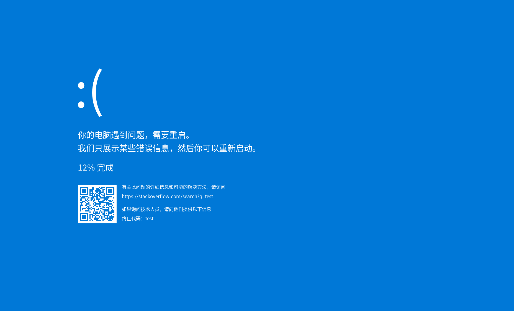

# bsod

在 Linux 原生终端 (TTY) 上模拟经典的 Windows 10 蓝屏显示工具，并移植了
[CustomBSOD](https://github.com/SECTOR0x7/CustomBSOD)（Windows 自定义蓝屏项目）的核心功能：
**自定义终止代码、背景色/文字颜色、自定义显示字符串、彩虹蓝屏、经典
Windows 7 VGA 文本模式（80x25 / 80x50、闪烁、彩虹）**。
通过抢占 DRM Master 直接在物理显示器上渲染，可用于演示/测试 KMS 相关功能。

> ⚠️ 该程序需要 **root 权限** 操作 VT 与 DRM，使用不当可能影响图形界面，请谨慎运行。

## 截图


## 目录结构

```
bsod/
├── meson.build        # Meson 构建脚本
├── bsod.conf.example  # 蓝屏外观配置示例（CustomBSOD 自定义项）
├── src/               # 源码与头文件放在一起
│   ├── bsod.h/.c      # 蓝屏主流程接口/编排 (7 步) + 现代/经典渲染 + 彩虹动画
│   ├── bsod_theme.h/.c# 外观主题（颜色/终止代码/自定义字符串/彩虹/VGA）+ 配置解析
│   ├── drm_util.h/.c  # DRM 工具 (打开设备/查找显示器/创建 FB/恢复)
│   ├── vt_util.h/.c   # VT 工具 (获取/切换虚拟终端)
│   ├── render.h/.c    # 帧缓冲绘制原语 (清屏/矩形/混合像素)
│   ├── font_util.h/.c # 文本渲染 (FreeType + fontconfig 系统字体)
│   ├── qr.h/.c        # 二维码绘制 + 编码 (内置 qrcodegen, Nayuki MIT)
│   ├── qrcodegen.h/.c # 二维码编码库 (内置第三方, Nayuki MIT)
│   ├── monitor.h/.c   # 系统日志监控 (journald 实时跟随)
│   ├── i18n.h/.c      # 内置多语言包 (en/zh-CN/zh-TW/ja/ko)
│   └── main.c         # 入口：root 检查，参数解析，配置文件加载
├── tools/designer/    # 可视化设计器（HTML 单文件，拖拽生成 C 代码）
└── build/             # 编译产物目录（Meson 生成，已 gitignore）
```

## 依赖

- 编译器：`gcc`（支持 C11）
- 构建工具：`meson` + `ninja`
- 头文件与库：`libdrm`、`freetype2`（字体渲染）、`fontconfig`（系统字体发现）、
  `libsystemd`（日志监控，journald）
  - Debian/Ubuntu: `sudo apt install libdrm-dev libfreetype-dev libfontconfig1-dev libsystemd-dev`
- 运行需要 `root` 权限

## 功能

- **蓝屏入口**：`bsod_show(const char *reason)` 显示一次完整蓝屏
  （VT 切换、DRM 抢占、渲染、进度动画、恢复）；原因串会写入终止代码、帮助链接与二维码。
  结束行为由 `bsod_set_exit_mode()` 控制（`BSOD_EXIT_REBOOT` 默认重启系统 /
  `BSOD_EXIT_RESTORE` 恢复桌面并退出）。
- **外观自定义（移植自 CustomBSOD）**：通过命令行选项或配置文件
  （`/etc/bsod.conf`、`~/.config/bsod/bsod.conf`，命令行优先）自定义蓝屏外观，
  由 `bsod_set_theme()` 注入渲染流程：
  - **自定义终止代码**（对应 Windows 版 `SP` 命令）：`--stop CODE` / `stop_code`。
  - **背景色**（`CR`）：`--bg COLOR` / `background`，默认 `0078D7`。
  - **前景/文字颜色**（`CC`）：`--fg` / `foreground`，`--text-bg` / `text_background`。
  - **自定义显示字符串**（`DS`）：`--string 'text|x|y|size|color'`（可重复）或
    `bsod.conf` 的 `[strings]` 段；现代模式坐标基于 1920x1080 设计画布，
    经典模式坐标即文本单元格（列、行）。
  - **彩虹蓝屏**（`RD`/`R7`）：`--rainbow` + `--rainbow-speed N`，色相循环整屏重绘。
  - **经典 Windows 7 VGA 文本模式**（VGA 模式）：`--vga`，支持 `--vga-cols` /
    `--vga-rows 25|50`、`--blink`（终止代码行闪烁）、彩虹。
  - **手动触发 BugCheck**：即 `--show "原因"`（Linux 上不真正崩溃系统，只显示蓝屏）。
- **系统日志监控**：`monitor_run()` 通过 sd-journal 实时跟随 journald，
  检测到优先级 <= err 或含失败特征（failed/error/main process exited 等）的日志时，
  生成一行原因并自动显示蓝屏；蓝屏结束后退出（重启模式不返回，恢复模式返回后退出）。
- **国际化**：内置 5 种语言包（en / zh-CN / zh-TW / ja / ko），按 POSIX 规范读取
  标准 locale 环境变量（优先级 `LC_ALL` > `LC_MESSAGES` > `LANG`，如 `LANG=zh_CN.UTF-8`），
  未设置或无法识别时默认英文；不依赖系统 locale 包。
- **清屏**：`render_clear()` 整屏填充任意颜色（0x00RRGGBB）。
- **任意位置写字**：`font_draw_text()`，字号可调，UTF-8 支持中文；
  通过 fontconfig 从系统字体目录（如 `/usr/share/fonts`）按族名加载字体，
  找不到时回退扫描常见目录；按当前语言自动选择对应字体族
  （zh-CN→Noto Sans CJK SC、zh-TW→TC、ja→JP、ko→KR、en→Noto Sans），
  保证中/日/韩文都能正确渲染。
- **二维码**：`qr_generate_text()` 使用内置 qrcodegen 库（Nayuki, MIT）把文本
  编码为可扫描的真实二维码，`qr_draw()` 在指定位置按样式绘制
  （背景/内容/外边框颜色、留白均可配置）。
- **可视化设计器**：`tools/designer/designer.html`（浏览器直接打开）在右侧画布
  拖拽添加文本/二维码，左侧实时调整属性并一键生成 C 代码；生成的代码内置
  `SCALE/OX/OY`，按目标 `SCREEN_W/SCREEN_H` 等比缩放居中适配不同分辨率。

## 编译

```bash
meson setup build          # 配置（首次）
meson compile -C build     # 编译
```

编译产物位于独立目录 `build/bsod`。

```bash
meson install -C build           # 安装到系统（需 root）
meson compile -C build --clean   # 清理
```

## 运行

```bash
sudo ./build/bsod --help              # 显示帮助
sudo ./build/bsod --monitor           # 前台监控系统日志
sudo ./build/bsod --show "原因"       # 一次性显示蓝屏（手动 BugCheck 触发）
sudo ./build/bsod --daemon            # 守护进程方式后台监控
sudo ./build/bsod --restore           # 蓝屏结束后恢复桌面并退出（默认是重启系统）
sudo ./build/bsod --dry-run           # 只打印检测到的错误，不显示蓝屏（调试）

# 外观自定义示例（全部可组合）：
sudo ./build/bsod --show "test" --bg 000000 --fg FF0000       # 黑底红字
sudo ./build/bsod --show "oops" --stop "KERNEL_PANIC"          # 自定义终止代码
sudo ./build/bsod --show "test" --rainbow --rainbow-speed 60    # 彩虹蓝屏
sudo ./build/bsod --show "test" --vga                          # 经典 Win7 文本蓝屏
sudo ./build/bsod --show "test" --vga --vga-rows 50 --blink     # 80x50 + 闪烁
sudo ./build/bsod --show "test" --string '你好|600|950|48|FFFFFF'  # 叠加自定义字符串
sudo ./build/bsod --show "test" --config /path/to/bsod.conf     # 用配置文件
```

无参数运行会显示帮助；至少需指定一个模式（`--monitor`/`--daemon`/`--show`/`--dry-run`）。

监控/一次性模式流程：渲染蓝屏 -> 进度动画到 100% -> **延迟 2 秒** ->
默认调用 `reboot` 重启系统；加 `--restore` 则改为恢复桌面并退出程序。

程序会自动：
1. 获取当前活动 VT（如 tty2）；
2. 切换到空闲的 tty6，让桌面挂起并释放 DRM Master；
3. 打开 `/dev/dri/card0` 并抢占 Master；
4. 获取物理分辨率，创建 dumb framebuffer 并填充蓝屏色；
5. 渲染内容（原因串）并推送到屏幕；
6. 进度动画约 10 秒到 100%；
7. 延迟 2 秒后重启系统（或 `--restore` 恢复桌面并退出）。

## 配置文件

把仓库内的 `bsod.conf.example` 复制到 `/etc/bsod.conf`（全局）或
`~/.config/bsod/bsod.conf`（当前用户）即可生效，支持的颜色/字符串/彩虹/VGA
等项见文件内注释。命令行选项的优先级高于配置文件；`--config FILE` 可显式指定
其它配置文件。

## 说明

- 显示模式取连接器 modes[0]（即物理原生分辨率）。
- DRM 设备自动探测：依次尝试 `/dev/dri/card0..card7`，选第一个带已连接显示器的
  卡（多显卡 / 卡号不固定时无需改代码）；也可用 `drm_open_device(ctx, "/dev/dri/cardN")`
  显式指定。
- 若无法获取当前 VT，恢复目标降级为 tty2。
- 空闲 VT 编号默认 `TARGET_VT = 6`，可在 `src/bsod.c` 中调整。
- 蓝屏原因：`--show` 时取命令行参数；监控模式由 `monitor_run()` 从日志生成
  后传入 `bsod_show(reason)`。
